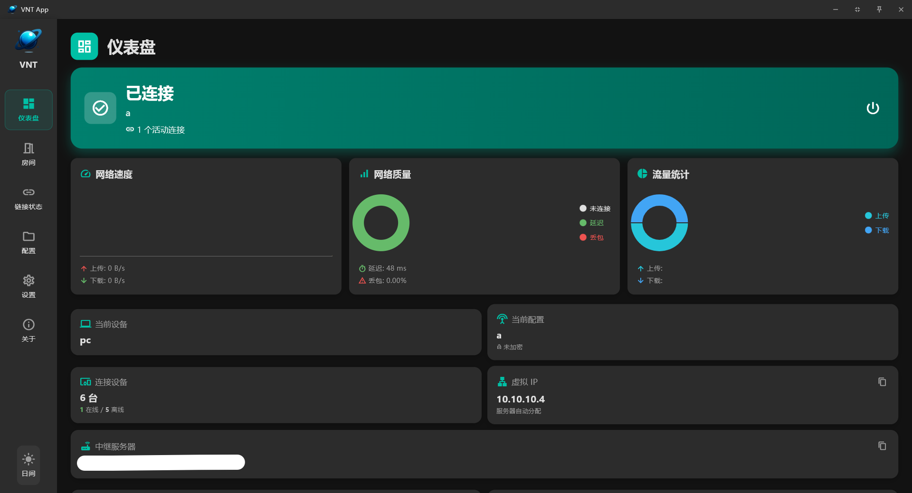
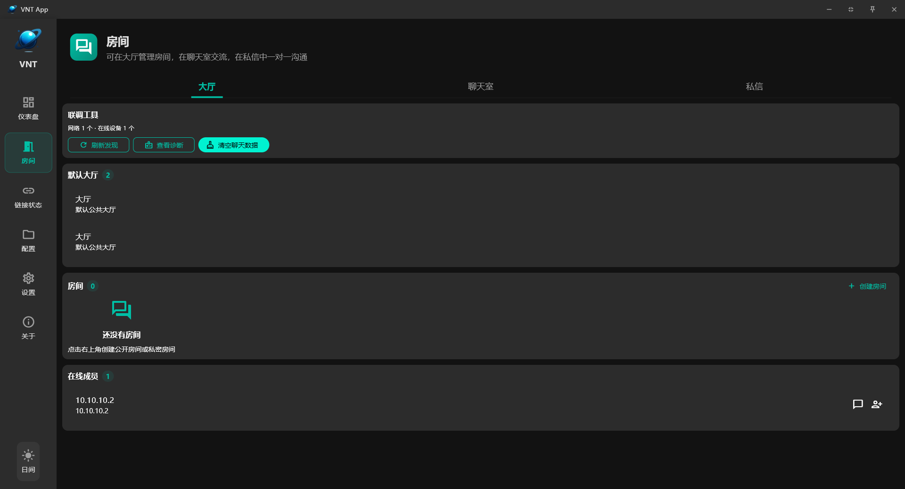
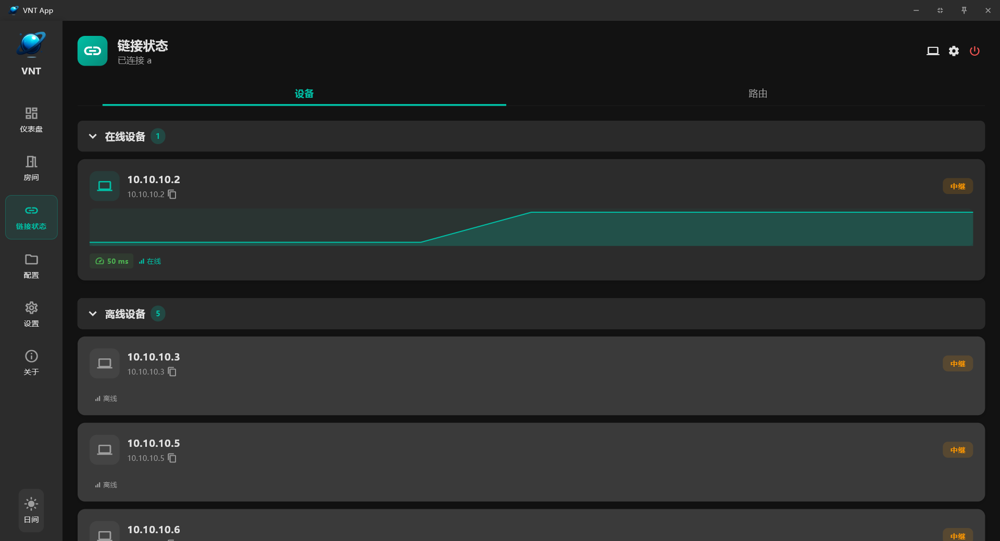
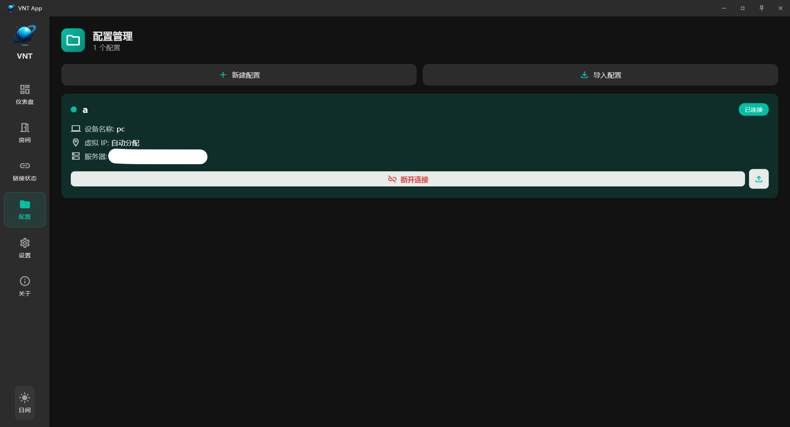
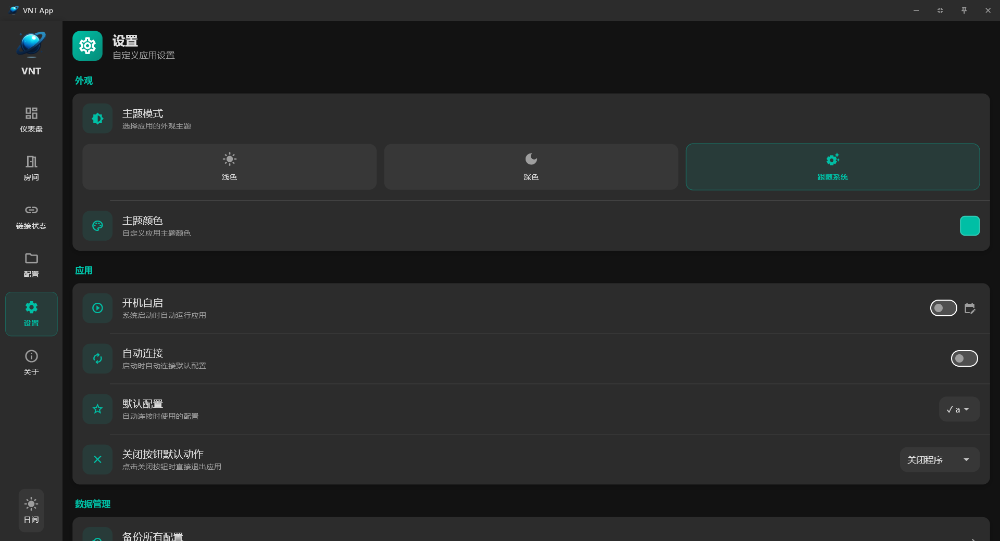
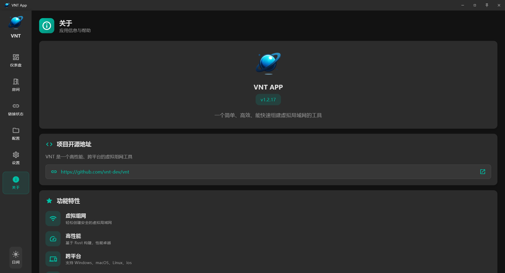

# VNTS / VNTC 2.0 Control Panels

一个 VNT 2.0 管理项目，当前已按项目边界拆分为 Linux 控制面板和 Windows 桌面端多个目录，根目录只保留项目级文档、计划、快照、资料与交付包。



## Windows 客户端界面预览

上图为当前 Windows 桌面客户端主界面封面图，便于用户直接看到软件实际 UI 风格。

其余主要页面如下，方便用户在首页直接查看实际功能界面：

<table>
  <tr>
    <td width="50%" align="center">
      
      <br />
      <sub>仪表盘：连接状态、流量、延迟、设备概览</sub>
    </td>
    <td width="50%" align="center">
      
      <br />
      <sub>房间：大厅、聊天室、私信与协作入口</sub>
    </td>
  </tr>
  <tr>
    <td width="50%" align="center">
      
      <br />
      <sub>链接状态：设备列表、路由与链路观察</sub>
    </td>
    <td width="50%" align="center">
      
      <br />
      <sub>配置管理：新建、导入导出、排序与编辑</sub>
    </td>
  </tr>
  <tr>
    <td width="50%" align="center">
      
      <br />
      <sub>设置：主题、语言、自启动、默认配置与数据管理</sub>
    </td>
    <td width="50%" align="center"></td>
  </tr>
</table>

客户端详情说明、功能介绍和更多页面截图见：

- [VntcApp1.0/README.md](VntcApp1.0/README.md)

## 根目录结构

```text
.
├── README.md
├── 项目开发规范.md
├── 项目开发文档.md
├── 项目开发计划/
├── 进度快照/
├── 项目资料/
├── 项目交付包/
├── vnts2.0/
├── vntc2.0/
└── VntcApp1.0/
```

## VNTS 2.0 服务端项目

目录：`vnts2.0/`

```text
vnts2.0/
├── server.py
├── vnt_panel/
├── static/
├── tests/
├── deploy/
├── linux/
└── packages/
```

运行面板：

```bash
cd vnts2.0
python3 server.py
```

默认监听：`0.0.0.0:2223`

开发校验：

```bash
cd vnts2.0
python3 -m unittest discover -s tests -p "test_*.py"
python3 -m py_compile server.py vnt_panel/*.py
```

## VNTC 2.0 客户端项目

目录：`vntc2.0/`

```text
vntc2.0/
├── client_server.py
├── vntc_panel/
├── vnt_panel/
├── static_client/
├── tests/
├── deploy/
├── linux/
└── packages/
```

`vntc2.0/vnt_panel/` 只保留客户端项目运行所需的共享认证与 systemd 管理模块，避免 VNTC 项目依赖外部目录。

运行面板：

```bash
cd vntc2.0
python3 client_server.py
```

默认监听：`0.0.0.0:2224`

开发校验：

```bash
cd vntc2.0
python3 -m unittest discover -s tests -p "test_*.py"
python3 -m py_compile client_server.py vnt_panel/*.py vntc_panel/*.py
```

## VNTC 2.0 Windows 桌面端项目

目录：`VntcApp1.0/`

```text
VntcApp1.0/
├── android/         # Android 客户端工程
├── assets/
├── docs/screenshots/
├── integration_test/
├── ios/             # iOS / VPN Extension / Widget
├── lib/             # Flutter 页面、配置管理、多连接状态管理
├── linux/
├── macos/
├── rust/            # 官方 VNT Rust 核心桥接
├── rust_builder/    # Flutter Rust FFI 插件构建层
├── scripts/
├── test/
├── third_party/
├── vendor/
├── web/
├── windows/         # Windows Runner、UAC 提权、wintun.dll 打包
└── windows_launcher/
```

当前 `VntcApp1.0/` 已同步为完整跨平台客户端源码目录，不再只有 Windows 相关代码，Android / iOS / macOS / Linux / Web / Rust bridge / packaging scripts 已一并补齐。项目在保留 Windows 桌面能力的同时，也保留了多平台客户端工程结构。

当前已补上：

- 自动复制架构匹配的 `wintun.dll`
- Windows Runner 管理员权限声明
- 多配置并发连接与多虚拟网卡支持
- Windows 主机构建脚本

Windows 主机构建入口：

```bat
cd VntcApp1.0
scripts\build_windows.bat
```

## 资料与交付

- `项目资料/VNT软件截图/`：页面截图资料。
- `项目交付包/release_bundle/`：统一交付包、历史交付目录与打包脚本。

重新生成统一交付包：

```bash
python3 项目交付包/release_bundle/build_release_bundle.py
```

## 默认账号

- 用户名：`luojiang`
- 密码：`luojiang`

登录后可在 Web UI 的“设置”页面修改账号和密码。
