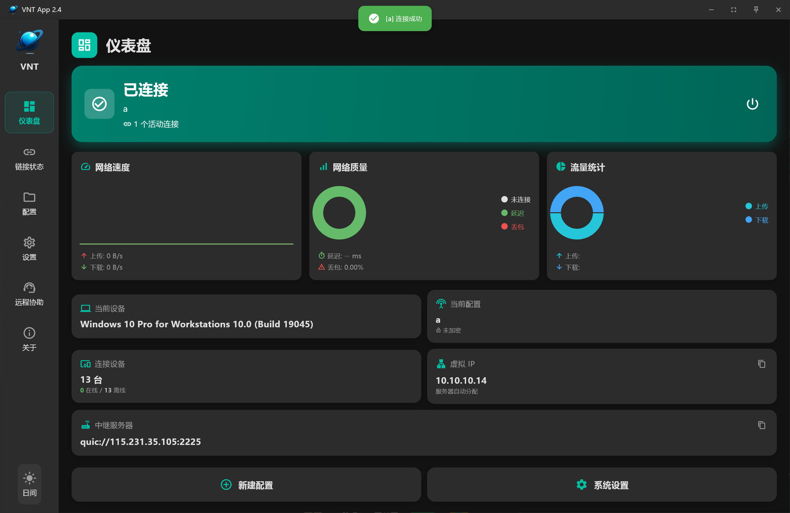

# VNT App

基于 Flutter + Rust 构建的跨平台远程协助与桌面连接工具。

> **对于本项目你可以问问 <a href="https://deepwiki.com/lmq8267/vntAPP"></a> 来了解功能或 `Fork` 后简单的修改一些功能，修改后 GitHub 可以自动打包好**

## 功能截图

### 设备列表 / 连接管理


主界面展示在线/离线设备列表，支持设备搜索、连接管理和状态监控。

### 远程协助


支持远程桌面连接与协助，提供流畅的远程操作体验。

### 设置与配置


灵活的配置选项，支持连接参数、安全设置和个性化定制。

## 主要功能

- **设备管理**：自动发现局域网内设备，在线状态实时显示
- **远程桌面**：低延迟远程桌面连接，支持多分辨率适配
- **远程协助**：安全的远程协助模式，支持会话密码保护
- **跨平台**：支持 Windows 便携版/安装版与 Android APK 部署
- **托盘运行**：最小化到系统托盘，后台持续服务

## Build

### 环境要求

安装 [Flutter](https://docs.flutter.dev/get-started/install) 和 [Rust](https://www.rust-lang.org/tools/install) 后，再安装 `flutter_rust_bridge`。

### 运行
```
flutter run
```

### 编译打包

- 便携包：`scripts/export_portable_package.ps1`
- 安装包：`scripts/export_installer_package.ps1`
- Android 品牌母版：`scripts/export_android_brand_package.ps1`
- 便携包产物：`release/portable`
- 安装包产物：`release/installer`
- Android 母版产物：`release/android`

版本号由 `scripts/build_version.txt` 自动管理，编译成功后自动递增。

### EXE / APK 一键品牌换牌

`tools/brand_repackager` 提供独立的 Windows 图形化换牌工具。它只有一个导入入口，会读取文件真实内容自动识别 Windows EXE 或 Android APK，没有手动模式选项，即使扩展名被改错也不会只按后缀误判。

Windows v4.8.17+ 母版可在不重新编译 Flutter/Rust 的情况下同步修改窗口标题、托盘名称、EXE/进程名、文件描述、安装目录、快捷方式和卸载名称。Android v4.8.20+ 品牌母版可同步修改应用名称、applicationId/默认进程标识、原生组件显示名和启动图标，并重新执行 16 KiB 对齐与 APK v2/v3 签名。

界面只需要导入源安装包、输入新名称，可选添加 ICO/PNG/JPG/BMP 新图标，并按需设置“移除升级功能”和“隐藏‘关于’页面”。“移除升级功能”默认勾选；点击“重新打包”后会弹出与识别格式对应的保存窗口，大图会自动等比缩放和压缩，不添加图标则保留来源图标。

最终工具为单个 `VNT_一键品牌换牌工具.exe`，已内置 Inno Setup、APKTool、Java 17 精简运行时、zipalign、apksigner、中文安装语言文件和 PE 资源修改器，终端用户不需要额外安装打包环境。Android 同一名称会在同一电脑、同一 Windows 用户下复用加密保存的包名和签名身份以支持覆盖安装；当前版本不支持把 DPAPI 签名档案直接迁移到另一用户或电脑。工具通过官方哈希/发布证书和本机品牌档案校验来源，仅支持本项目声明品牌能力的 VNT 母版，不是任意第三方 EXE/APK 修改器。完整说明见 `tools/brand_repackager/README.md`。

## Special

Thanks to ChatGPT for helping with a lot of the work on this project.
