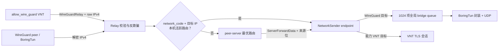

# WireGuard 模块 5.1：数据桥接、路由与 MTU

## 1. 目标与边界

本模块在模块 5.0 的可选 UDP listener、多 peer BoringTun 运行时和会话生命周期之上，建立服务端可用的 IPv4 数据路径。实施范围仅限 VNTS 服务端，不修改 Web 页面、VNT 客户端或部署流程。

核心安全原则是：服务端不解密 VNT 普通 `Turn` 载荷，只将已冻结的 `WireGuardRelay(18)` 视为可桥接原始 IPv4；只有显式声明 `allow_wire_guard=true` 且完成注册的 VNT 会话能与 WireGuard 互通。

## 2. D1–D12 冻结决策

| 决策 | 实施结果 |
| --- | --- |
| D1 桥接方向 | 支持能力 VNT↔WireGuard 与 WireGuard↔WireGuard；不开放 legacy VNT↔WireGuard。 |
| D2 数据模型 | 仅 `WireGuardRelay(18)` 携带原始 IPv4；普通 VNT `Turn` 不能进入 WireGuard endpoint。 |
| D3 跨服来源 | `ServerForwardData.source_is_wireguard` 保留来源类型；protobuf 新字段对旧数据默认 `false`。 |
| D4 路由模型 | WireGuard peer 只在认证活跃期注册为在线 endpoint；仅能力 VNT 看到 `NodeType::Wireguard`。 |
| D5 目标路由 | 同虚拟网络单播，本机活跃路由优先，本机不存在时才使用现有 peer-server 最优路由。 |
| D6 特殊目标 | 丢弃网络地址、子网广播、`255.255.255.255`、组播、网关和网外目标；VNT 广播分支过滤 WireGuard endpoint。 |
| D7 源地址 | WireGuard 明文源必须精确等于 peer 预留 IPv4；VNT Relay 外层源、内层源与会话 IP 必须一致。 |
| D8 回程入口 | 统一路由将 Relay 投递到全局有界 bridge queue，运行时按 `network_code + destination` 找活跃 peer，再交给 BoringTun 封装。 |
| D9 MTU | 内层 IPv4 上限固定 1420 字节；要求 IPv4 `total_length` 与载荷精确一致；服务端不分片、不重组、不改 MSS、不合成 ICMP，但允许已存在且单片不超限的 IPv4 分片。 |
| D10 IP 变更 | 重新预留、释放、禁用或删除都撤销对应活跃会话；API 成功返回前已等待撤销确认。 |
| D11 流控与统计 | 所有网络共享 1024 项 bridge queue；本阶段不增数据面速率限制；会话记录 RX/TX、拒绝和丢弃计数，队列满时静默丢弃并计数。 |
| D12 错误与线性化 | 数据面无路由、非法包和背压都静默丢弃；并发中的旧握手可能短暂收到响应，但撤销 API 确认是最终线性化点，其后旧会话不再可用。 |

## 3. 数据路径



### 3.1 VNT 到 WireGuard

1. 会话必须已注册且 `allow_wire_guard=true`。
2. 只接受非 gateway、非 compressed、TTL 非零的 `WireGuardRelay`。
3. 外层源/目标必须与内层 IPv4 一致，内层源必须等于会话 IP。
4. 本机目标不存在时才尝试跨服路由。
5. 目标 WireGuard endpoint 通过全局队列交给运行时封装。

### 3.2 WireGuard 到 VNT / WireGuard

1. BoringTun 认证解密后，内层源必须等于 peer 预留 IP。
2. 通过统一 IPv4 校验后构造 `WireGuardRelay`，来源标记为 WireGuard。
3. 目标为 VNT 时，只允许已确认的能力会话；目标为另一 WireGuard 时使用同一 bridge queue。
4. 跨服时 `source_is_wireguard=true` 不丢失，因此远端 legacy VNT 仍会拒绝 Relay。

## 4. 在线路由与生命周期

- `sender_map` 从单一 VNT channel 扩展为类型化 `NetworkSender`，区分 VNT 与 WireGuard endpoint。
- WireGuard peer 在首次合法握手懒创建时注册，在过期、禁用、删除、IP 变更/释放或运行时关闭时移除。
- 活跃 WireGuard 节点变更会推进 `data_version`；能力 VNT 得到完整 WireGuard 节点列表，legacy VNT 的列表保持不变。
- peer-server 路由同步只广告活跃 endpoint，断开连接时清理对应路由。
- 原 peer-server 实现只发送 QUIC datagram 却未接收；本模块在现有通信循环中增加 `read_datagram()` 分支，复用同一 `ServerMessage` 处理器，使跨服数据路径真正可用。

## 5. 背压、统计与错误语义

- 全局 bridge queue 容量为 1024，所有网络和 peer 共享，避免为每个 peer 建立无界缓冲。
- 队列满、目标不在线、目标不兼容、无跨服路由和非法 IPv4 均静默丢弃，避免对不可信数据面放大错误响应。
- WireGuard 会话统计认证接收字节、成功发送字节、拒绝包和丢弃包；会话移除时写入 debug 日志。
- 数据面本阶段不叠加新限速；握手仍使用模块 5.0 的全局 `100/s RateLimiter` 和 Cookie Challenge。

## 6. 协议兼容性

- `MsgType::WireGuardRelay = 18` 和注册 `allow_wire_guard` 字段保持已冻结数值。
- `ServerForwardData.source_is_wireguard = 3` 是可选语义的新 protobuf 字段；旧消息解码为 `false`。
- legacy VNT 既不获得 WireGuard 节点列表，也不能发送或接收 WireGuard Relay。
- 混合版本 peer-server 中，旧服务端不会生成 `source_is_wireguard=true`；新服务端对缺失字段按 VNT 来源处理，不会将未标记 Relay 降级投递给 legacy VNT。

## 7. 验证

模块新增或扩展的验证覆盖：

- IPv4 结构、1420 上限、已有分片、反欺骗、特殊目标和 Relay 封装校验。
- 类型化 endpoint 投递矩阵、全局队列背压计数、WireGuard 节点能力列表。
- 真实双 WireGuard peer 的 1420 字节与反向数据、1421 丢弃、组播丢弃、IP 变更/释放后旧会话撤销。
- 真实 VNT TLS 协议与 WireGuard 同机双向原始 IPv4，以及 legacy 双向隔离。
- 两个真实 VNTS 进程间的 VNT↔WireGuard 跨服双向数据，以及跨服来源位防降级。
- 完整测试集：65/65 通过（模块 5.0 基线为 56/56）。

阶段最终验收：

```text
cargo fmt --all -- --check                       通过
cargo check --locked --all-targets               通过
cargo test --locked                              65/65 通过
cargo clippy --locked --all-targets -- -A clippy::never_loop
                                                  通过，仅既有警告
cargo audit                                      通过，无漏洞
cargo deny check licenses sources                通过，1 个已允许 yanked 警告
git diff --check                                 通过
cargo build --release --locked                   通过
```

Windows 构建显式将 `C:\Program Files\NASM` 置于 Strawberry NASM 之前，实际使用 NASM 3.02。

```text
产物：target/release/vnts2.exe
大小：6,019,072 字节
SHA-256：E0DB301022868D9A6F24C4ACD1D10613F9C79FEBBD0676736108E880AB617CF3
```

## 8. 已知限制

- 本模块不提供 IPv6 桥接、NAT、跨虚拟网络路由、广播/组播桥接、服务端分片/重组、MSS clamp 或 ICMP Packet Too Big。
- VNT 客户端必须自行将虚拟接口 MTU 配置为 1420 或更低；客户端实现不在本阶段范围。
- 会话统计目前为运行时日志数据，未新增 Web 展示或持久化数据模型。
- peer-server 路由同步沿用现有 30 秒周期；连接初始建立会立即同步，周期内的后续路由变化在下次同步前可能暂时不可达。
