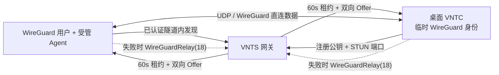

# WireGuard 模块 5.3：受管 Agent 与 VNTC 混合 P2P

## 1. 结果

本模块已实现“WireGuard 用户安装受管 Agent，与桌面 VNTC 用户建立真实 P2P”。直连成功后，业务 IPv4 数据不经 VNTS；VNTS 只承担已认证发现、短租约签发和必要时的原有中继。

## 2. 冻结产品与安全行为

| 主题 | 实施结果 |
| --- | --- |
| 身份 | Agent 请求走现有 WireGuard 隧道，以活动 BoringTun peer 会话识别，不增加另一套高权限凭据。 |
| VNTC 密钥 | 每次运行生成临时 X25519/WireGuard 身份，不共享 VNTS 服务端私钥。 |
| 端点绑定 | VNTC 只上报 STUN 映射端口；服务端使用实际控制连接的 IPv4，防止任意 UDP 反射目标。 |
| 路由安装 | Agent 先配置无 `AllowedIPs` 的探测 peer，只在新握手成功后安装目标 `/32`。 |
| 直连可用性 | VNTC 要求租约有效，且 45 秒内有认证数据或握手；否则不选择直连。 |
| 回退 | 无能力、忙、超时、NAT 失败、租约过期或撤销均恢复现有 `WireGuardRelay(18)`。 |
| 撤销 | peer 禁用/删除/IP 变更/ConnectionExpired/关闭时，服务端按精确 `lease_id` 通知 VNTC；旧租约撤销不影响已刷新租约。 |
| 范围 | 同服务器 IPv4 单播；跨服务器继续中继，特殊地址与网外地址拒绝。 |
| 流控 | Agent 请求每 peer 最多 1/s；VNTC 共享 100/s BoringTun `RateLimiter`，最多 64 个直连 peer，命令队列 256。 |
| MTU | 继承模块 5.1 的 IPv4 1420 上限，不分片、不重组、不修改 MSS。 |

## 3. 协议

### 3.1 VNTC 注册

`RegRequestMsg` 在能力位 `allow_wire_guard=true` 之上增加：

- 字段 11：`wireguard_p2p_public_key`，必须精确 32 字节。
- 字段 12：`wireguard_p2p_port`，必须非零。

两者必须同时存在；旧客户端缺失时自然视为不支持 P2P，继续中继。

### 3.2 Agent 控制

- Agent 向虚拟网关 UDP `51821` 发送 `WireGuardP2pAgentRequest`。
- 服务端只接受解密后源 IPv4 精确等于 peer 预留地址、目标精确等于网关、非分片且长度严格的 UDP 报文。
- 响应与 VNTC Offer 绑定同一 `request_id`/目标/`lease_id`/过期时间。
- 服务端只在 Offer 已成功投递给目标 VNTC 后才向 Agent 返回成功。

### 3.3 VNT 控制帧

`MsgType::WireGuardP2pControl = 20`，必须具有 gateway flag、TTL 非零、源为网关且目标为本机。负载为 `Offer` 或精确租约 `Revoke`。

## 4. 数据面与生命周期

1. 桌面 VNTC 启动时绑定 IPv4 UDP socket，复用现有 VNT NAT 检测的默认/自定义 STUN 列表发现映射端口。
2. VNTC 注册临时公钥和映射端口，服务端用实际连接 IP 构造可发现端点。
3. Agent 发现目标，服务端向双方签发 60 秒内存租约。
4. VNTC BoringTun 与操作系统 WireGuard 接口直接握手；双方均允许认证后 endpoint roaming。
5. Agent 观测新握手后安装 `/32`；VNTC `HybridOutbound` 在直连可用时优先发送，失败则继续原服务端路径。
6. Agent 每 20 秒刷新。同公钥刷新保留 BoringTun 会话；密钥轮换、租约过期或精确撤销删除会话。

## 5. 平台行为

- Windows/macOS/Linux VNTC：启用混合 P2P。
- Android/iOS VNTC：本阶段不创建 P2P socket，因为需要 `VpnService.protect()`/`NetworkExtension` 的原生 socket 豁免；继续使用已验证中继。
- IPv6 控制连接不广告为当前 IPv4 P2P 端点，以失败关闭方式回退。

## 6. 验证结果

- VNTS：71 项测试通过，包括真实 BoringTun UDP 隧道内 Agent 发现、VNTC Offer 绑定与 peer IP 释放后精确撤销。
- VNTC Rust：根 crate 4 项、`vnt-core` 26 项通过；Flutter 172 项通过，`flutter analyze` 无问题。
- Agent：4 项通过，Clippy `-D warnings` 通过。
- `cargo audit`：三个 Rust 交付物无已知漏洞；客户端仅保留 037 已记录的 5 个未维护间接依赖提示，服务端保留既有 yanked `spin 0.9.8` 警告。
- `cargo deny check licenses sources`：三端均通过。
- `git diff --check`：通过。
- Release：VNTS、Agent、Windows VNTC 和 Android APK 全部构建成功。Windows AWS-LC 构建使用 NASM 3.02，`C:\Program Files\NASM` 优先。

## 7. Release 校验

| 产物 | 大小（字节） | SHA-256 |
| --- | ---: | --- |
| `target/release/vnts2.exe` | 6,031,360 | `756E039DBFD1E67A0193C8A3D91595B5303585A3961F1BF8544AB44B082AB306` |
| `wireguard-agent/target/release/vnts-wireguard-agent.exe` | 409,600 | `30BE96624076B97B478590A7061ED68705C8868A4873371CB1706A1DF6374825` |
| `VntcApp1.0/.../Release/rust_lib_vnt_app.dll` | 10,463,232 | `4325C13DEECB16419A60471BFB786C7BAD47206EFC3C401FDAF83D26E00512F7` |
| `VntcApp1.0/build/app/outputs/flutter-apk/app-release.apk` | 68,372,243 | `80B9840E08BFA1E326F317FD51F067380B18454A35C41DA2F5480BC2B3B4B04D` |

## 8. 已知限制

- 首版不提供跨服务器直连协调、TURN 中继、IPv6、广播/组播、移动端原生 socket 豁免。
- 对称 NAT/严格防火墙可能使 UDP 直连失败；该情况按设计使用 VNTS 中继。
- Agent 本阶段是可交付命令行运行时，未进入服务安装器、Web 管理页或自动部署阶段。
